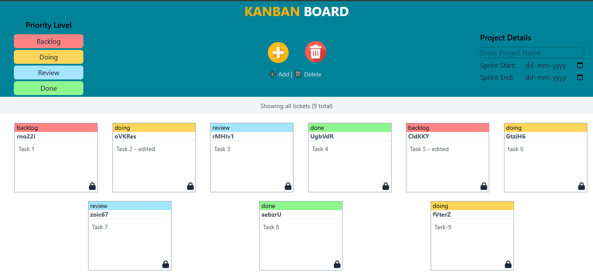
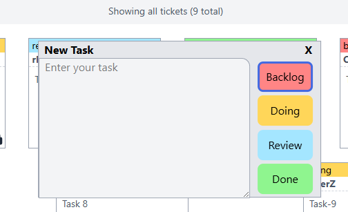

# Kanban Board React App

An interactive Kanban Board built with React to help manage tasks through various workflow stages. This app allows creating, editing, filtering, locking, and deleting tickets with persistent local storage.

## Features

- Add, edit, and delete task tickets.
- Status categories with color labels: Backlog, Doing, Review, Done.
- Lock/unlock ticket editing to prevent accidental changes.
- Filter tickets by status.
- Modal interface for creating new tickets.
- Local storage support for persisting tickets after refresh.
- Simple and responsive UI using TailwindCSS.
- Integration of FontAwesome icons for intuitive controls.

## Installation

1. Clone the repository: git clone <repository-url>
2. Install dependencies: npm install
3. Run the development server: npm start
4. Open [http://localhost:3000](http://localhost:3000) in your browser to see the app.

## Usage

- Click the **Add Ticket** button to open a modal and add a new task with a chosen status.
- Click individual tickets to lock/unlock them for editing or to modify their content.
- Use the status filter buttons to show tickets for specific categories.
- Toggle Delete Mode to safely remove tickets.
- Project and sprint details can be managed from the navbar area.

## Technologies Used

- React.js
- Context API for state management
- TailwindCSS
- FontAwesome icons

## File Overview

- `App.jsx` – Main component handling layout and rendering tickets.
- `Navbar.jsx` – Handles project details, filters, and delete mode.
- `ModalContainer.jsx` – Modal dialog for adding new tickets.
- `Ticket.jsx` – Ticket component managing individual tasks.
- `StoreContext.jsx` – Provides global state management with localStorage.
- `colors.js` – Defines color scheme for ticket statuses.
- `index.css` / `App.css` – Styling files.
- `Header.jsx` – App title header component.

## Screenshot

